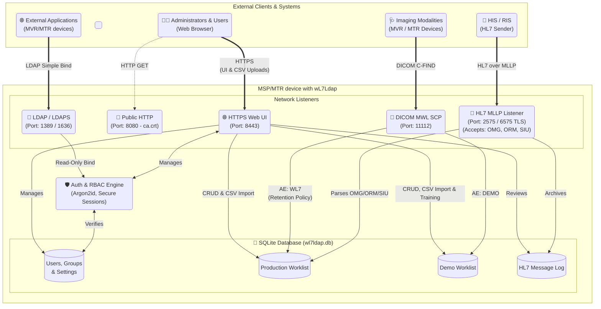

# **MediCapture DICOM & HL7 Integration Guide**

This guide contains the official documentation, specifications, and configuration guides for the **AKDICOM Feature** and the **wL7Ldap Integration Suite** used on MediCapture MVR and MTR-series medical video recorders.

# **Part 1: AKDICOM Feature and Activation Key**

This section describes the DICOM (Digital Imaging and Communications in Medicine) features available for MediCapture MVR/MTR-series medical video recorders.

## **Product Information**

* **Product Name:** AKDICOM  
* **Product Type:** Digital code for feature activation  
* **Product Description:** Activation key for DICOM worklist import and PACS export  
* **Device Grade:** None  
* **Medical Device Classification:** None

## **Compatibility**

* Compatible with MediCapture MVR-series and MTR-series medical video recording devices.  
* **Compatible devices of other brands:** None.  
* *Note: The activation key is specific to the particular MVR/MTR device identified by its unique Device ID and will not function on other devices.*

## **Ordering Process**

* **How to Order:** Can be ordered pre-installed with a new device or ordered at any time afterward.  
* **Required Information:** MVR/MTR device Serial Number and Device ID (visible on the device's *Information* screen).  
* **Ordering Code:** AKDICOM  
* **Package Content:** 8-digit hexadecimal code  
* **Pricing:** Contact MediCapture for quotes.

## **General Functional Description**

DICOM connectivity features enable MVR/MTR-series devices to integrate seamlessly with hospital network environments:

1. **Worklist Query:** When the recorder is connected and configured to a Modality Worklist (MWL) server, users can retrieve the scheduled patient worklist every time a new study is started. Selecting a worklist item embeds patient data directly into the metadata of captured images and recorded videos.  
2. **Internal Storage & PACS Export:** The entire study is recorded directly to the device's internal storage. Captured images, videos, and PDF reports can then be exported to a Picture Archiving and Communication System (PACS) either manually or automatically. The acceptance of specific file formats depends on external PACS settings.  
3. **Pre-Activation Testing:** DICOM setup and test screens are fully accessible without entering an activation key. This allows hospital IT departments to verify server handshakes, network routing, and query/retrieve filters before purchasing an activation license.

## **Activation and Settings**

1. **Installation:** No physical installation or software installation is required.  
2. **Privileges:** Users must have **Administrator** privileges to configure or activate DICOM settings.  
3. **Internal Storage:** Must be enabled under **Storage Settings** to store study files locally prior to PACS export. Set the video resolution next to "Internal Storage" (or select "Only images" if you do not want videos sent to PACS).  
4. **Network Verification:** Confirm the device status shows a valid network connection on the *Information* screen.  
5. **Patient Info Settings:** On the Patient Info Settings screen, change **Patient Info** from "Off" to "Human" (or "Veterinarian"). Enter the Hospital Name, Department Name, Location, and Device Title (Calling AE Title).  
6. **Enable Worklist:** Turn on **Worklist Search** in the Patient Info Settings screen to proceed with Worklist server setup.  
7. **PACS Export:** Enable DICOM Export to PACS in the **Archive Settings / Export** screen.  
8. **Server Setup & Test:** Perform PACS and Worklist server configuration and use the built-in **Test** buttons to verify connectivity.  
9. **License Activation:** To activate permanently, navigate to **Advanced Device Settings \-\> Activation Keys** and enter the 8-digit hexadecimal code. The text next to "DICOM software" will change to **Unlocked**.  
10. All DICOM workflows are now ready for live deployment.

# **Part 2: DICOM Conformance Statement**

## **General Implementation Specifications**

* **Implementation Class UID:** 1.2.826.0.1.3680043.9.7572.1.2  
* **Implementation Version Name:** MEDICAPDCM 1.2  
* **Maximum PDU Size:** 65536 bytes  
* **Storage SCP Outgoing Local Port Number:** 3383

## **Supported Transport Streams (TS)**

* **JPG:** JPEG Baseline, UID: 1.2.840.10008.1.2.4.50  
* **H264:** MPEG-4 AVC/H.264 High Profile / Level 4.1, UID: 1.2.840.10008.1.2.4.102  
* **HEVC:** HEVC/H.265 Main Profile / Level 5.1, UID: 1.2.840.10008.1.2.4.107  
* **IVRLE:** Implicit VR Little Endian, UID: 1.2.840.10008.1.2  
* **EVRLE:** Explicit VR Little Endian, UID: 1.2.840.10008.1.2.1

## **Supported SOP Classes**

supported\_sop\_classes:  
  \- sop\_class\_name: Verification  
    sop\_class\_uid: 1.2.840.10008.1.1  
  \- sop\_class\_name: Secondary Capture Image Storage  
    sop\_class\_uid: 1.2.840.10008.5.1.4.1.1.7  
  \- sop\_class\_name: Multi-frame True Color Secondary Capture Image Storage  
    sop\_class\_uid: 1.2.840.10008.5.1.4.1.1.7.4  
  \- sop\_class\_name: VL Endoscopic Image Storage  
    sop\_class\_uid: 1.2.840.10008.5.1.4.1.1.77.1.1  
  \- sop\_class\_name: Video Endoscopic Image Storage  
    sop\_class\_uid: 1.2.840.10008.5.1.4.1.1.77.1.1.1  
  \- sop\_class\_name: VL Photographic Image Storage  
    sop\_class\_uid: 1.2.840.10008.5.1.4.1.1.77.1.4  
  \- sop\_class\_name: Video Photographic Image Storage  
    sop\_class\_uid: 1.2.840.10008.5.1.4.1.1.77.1.4.1  
  \- sop\_class\_name: VL Microscopic Image Storage  
    sop\_class\_uid: 1.2.840.10008.5.1.4.1.1.77.1.2  
  \- sop\_class\_name: Video Microscopic Image Storage  
    sop\_class\_uid: 1.2.840.10008.5.1.4.1.1.77.1.2.1  
  \- sop\_class\_name: Encapsulated PDF Storage  
    sop\_class\_uid: 1.2.840.10008.5.1.4.1.1.104.1  
  \- sop\_class\_name: Modality Worklist Information Model \- FIND  
    sop\_class\_uid: 1.2.840.10008.5.1.4.31

## **Presentation Context Table**

presentation\_context:  
  \- abstract\_syntax: Modality Worklist Information Model \- FIND  
    transfer\_syntaxes:  
      \- IVRLE  
    role: SCU  
  \- abstract\_syntax: Verification  
    transfer\_syntaxes:  
      \- IVRLE  
    role: SCU  
  \- abstract\_syntax: Secondary Capture Image Storage  
    transfer\_syntaxes:  
      \- JPG  
      \- EVRLE  
    role: SCU  
  \- abstract\_syntax: Multi-frame True Color Secondary Capture Image Storage  
    transfer\_syntaxes:  
      \- H264  
      \- HEVC  
    role: SCU  
  \- abstract\_syntax: VL Endoscopic Image Storage  
    transfer\_syntaxes:  
      \- JPG  
      \- EVRLE  
    role: SCU  
  \- abstract\_syntax: Video Endoscopic Image Storage  
    transfer\_syntaxes:  
      \- H264  
      \- HEVC  
    role: SCU  
  \- abstract\_syntax: VL Photographic Image Storage  
    transfer\_syntaxes:  
      \- JPG  
      \- EVRLE  
    role: SCU  
  \- abstract\_syntax: Video Photographic Image Storage  
    transfer\_syntaxes:  
      \- H264  
      \- HEVC  
    role: SCU  
  \- abstract\_syntax: VL Microscopic Image Storage  
    transfer\_syntaxes:  
      \- JPG  
      \- EVRLE  
    role: SCU  
  \- abstract\_syntax: Video Microscopic Image Storage  
    transfer\_syntaxes:  
      \- H264  
      \- HEVC  
    role: SCU  
  \- abstract\_syntax: Encapsulated PDF Storage  
    transfer\_syntaxes:  
      \- IVRLE  
    role: SCU

### **Protocol & Mapping Nuances**

* **Image Conversion:** Images captured in JPEG format are transmitted via JPG Transport Stream (TS). If the remote server does not support JPG TS, the device converts them to uncompressed RGB and transmits using EVRLE TS. Uncompressed PNG captures are transmitted directly using EVRLE TS.  
* **Error Handling:** If transfer fails, the Storage SCU does not automatically retry. The operator is notified of the failure reason and must trigger a manual retry.  
* **Study & UIDs:** Exported images use the Study Instance UID provided by the Modality Worklist if available. If a study date/time is missing in the Worklist, or for unscheduled studies, the device generates UIDs and timestamps locally.  
* **Device Traceability:** To facilitate asset tracing, the Device ID is written to DICOM tag (0018,1003) and the firmware version is written to tag (0018,1020). This info is also mirrored in EXIF metadata.  
* **Note on Serial Numbers:** The physical serial number is only printed on the hardware labels; use the software-visible Device ID for digital tracking.

# **Part 3: DICOM & Worklist Setup Guide**

## **Worklist Server Setup Screen Config**

* **Required Parameters:** Server IP, Server Port, Server Title (Called AET), and Device Title (Calling AET).  
* **Default Character Set:** Standard is UTF-8 (ISO\_IR 192). Other options include ISO-8859-1 (ISO\_IR 100), EUC-KR (Korean), Big5 (Traditional Chinese), and Do not use (for legacy worklist servers that cannot process character sets).  
* **Broad Worklist Query Matching Keys:**  
  * **Match by Scheduled Device Title:** Limits worklist retrieval to jobs matching the recorder’s AE Title.  
  * **Modality Filter:** Restrict query to XC (External-camera), ES (Endoscopy), GM (General Microscopy), or SC (Secondary Capture).  
  * **Scheduled Date Range Filters:**  
    * *Today:* Filters procedures scheduled for today and tomorrow.  
    * *Today and newer:* Pulls schedule for today and up to 10 days in the future.  
    * *Recent:* Spans from 2 days in the past to 10 days in the future.  
    * *Last week:* Covers today and the previous 6 days.  
    * *Last month:* Covers today and the previous 30 days.  
* *Tip: Set matching keys to "Any" or "Disabled" during initial network testing.*

## **Worklist User Guide**

1. **Starting a Study:** A pop-up 'Worklist search' window displays automatically. Select "Search" with all fields blank to pull the broad query defined in settings.  
2. **List Limits:** The system caches and lists a maximum of 200 entries.  
3. **Filtering:** Type directly on-screen to filter results in real-time by Name or Patient ID.  
4. **Advanced Query Fields:** To narrow down long lists, filter by: Accession number, Patient name (last), Patient ID, Procedure ID, and Scheduled physician. Character wildcards (e.g. Cl\*) are supported depending on the server type.  
5. **Verify Data Screen:** Selecting a patient opens a read-only validation screen. Edit restrictions apply:  
   * **Allowed Modifications:** Performing Physician, Referring Physician, Anatomic Region, and Scheduled Procedure Step Description.  
   * **Blocked Modifications:** Inbound demographics (Name, DOB, Patient ID) pulled from MWL cannot be altered.  
6. **Procedure Step Status Alert:**  
   * Statuses such as SCHEDULED, ARRIVED, or READY appear in standard blue text.  
   * Warning statuses like STARTED or DEPARTED appear in orange, alerting operators that the procedure might be a duplicate.  
7. **Anatomic Region Mapping:** Required for Visual Light modalities (such as ES for Endoscopy). It consists of three fields: Anatomic Region, and two optional modifier fields. Smart filtering is available (e.g., typing "C" shows all regions containing "C").  
8. **Unscheduled Patient Workflow:** Tap **Unscheduled** on the Worklist search screen to manually enter emergency demographic details and start a recording immediately.

### **Offline Worklist Security (Informative)**

The worklist is cached locally using encryption unique to the hardware signature of the device. Cached files older than 24 hours are auto-deleted upon device boot. Administrators can disable the offline local cache feature via the web portal.

### **Troubleshooting**

* **Factory Reset:** Performing a factory reset will delete entered Activation Keys. Note down your keys or keep them printed on the device label. If lost, provide the Device ID and purchase receipt to customer support to recover them.

# **Part 4: wL7Ldap Server Documentation**

The **wL7Ldap** software suite is an integrated medical imaging worklist and LDAP directory server compiled into a single binary. It merges HL7 message reception, DICOM modality worklist serving, and user authentication on local networks.

## **Features**

* **HTTPS Web UI (Port 8443):** Administrative dashboard using role-based access control (admins, mvradmins, users).  
* **LDAP / LDAPS Directory (Ports 1389 / 1636):** Read-only authentication directory for external clinic apps and system sign-ons.  
* **HL7 MLLP Listener (Port 2575 / 6575 TLS):** Automatically ingests incoming OMG, ORM, and SIU scheduling messages into the production database.  
* **DICOM MWL SCP (Port 11112):** Serves cached schedules to imaging modalities using target AE titles.  
* **Unified Database:** Powered by SQLite (wl7ldap.db), combining user data, demo/production worklists, settings, and logs into one portable file.  
* **Encryption:** Modern Argon2id password hashing.

# **Part 5: wL7Ldap HL7 Mapping & Upsert Semantics**

## **Inbound HL7 Field Mappings**

Below is the structured data mapping showing how raw incoming HL7 message fields are transformed into local Worklist parameters.

| Worklist Element | HL7 Path | Default / Custom Rules |
| :---- | :---- | :---- |
| **Patient ID** | PID-3.1 (ID) | Required. Leading/trailing spaces are trimmed. |
| **Patient ID Issuer** | PID-3.4 (Assigning Authority) | Emitted in MWL responses as IssuerOfPatientIDSequence. |
| **Patient Name** | PID-5.1 (Family), PID-5.2 (Given) | Joined into Family^Given. Other components like suffix (PID-5.3) and prefixes are mapped if present. |
| **Date of Birth** | PID-7 | Mapped and converted into DICOM DA format (YYYYMMDD). |
| **Patient Sex** | PID-8 | Mapped to M, F, or O. If empty, defaults to O. |
| **Accession Number** | ORC-8 or OBR-18 | Ingests from ORC-8 first. Falls back to OBR-18 if ORC-8 is null. Required for upserting. |
| **Requested Procedure ID** | OBR-19 | Maps to DICOM Requested Procedure ID. |
| **Modality** | OBR-24 | Auto-normalizes code aliases (e.g., XR \-\> DX, MAMO \-\> MG, ECHO \-\> US). Falls back to OT if missing or invalid. |
| **Scheduled Date & Time** | OBR-36 or ORC-15 | Read from OBR-36 first, falls back to ORC-15. Parses ISO-like formats, then outputs DICOM Date (DA) and Time (TM). |
| **Scheduled Room/Station** | OBR-24 (or MSH-21 setup) | Maps to DICOM Scheduled Station Name. |
| **Performing Physician** | OBR-16 (Family^Given) | Populates the Scheduled Performing Physician Name. |
| **Procedure Description** | OBR-4.2 (Universal Service ID) | Truncated to a max of 64 characters before save. |

### **Technical Formatting Details**

* **Character Encoding:** Characters are parsed using UTF-8 (or ISO\_IR 192 if the server fails to specify).  
* **Scheduled Procedure Step Sequence:** ScheduledProcedureStepSequence (0040,0100) is only emitted if at least one parameter within the block contains data.  
* **Description Placement:** ScheduledProcedureStepDescription (0040,0007) is always inside the sequence block rather than at the top root directory level.

## **Upsert and Deletion Semantics**

### **Same-Order Identity Key**

To resolve duplicate, update, or cancel actions, wL7Ldap calculates an identity key:

### **![][image1]Upsert Rules (Insert/Update)**

1. **Accession exists and same-order matches:** Update existing worklist record *only* if mapped payload data has changes.  
2. **Accession exists but patient ID differs:** Flagged as an external database collision; ignore update safely to preserve data integrity.  
3. **Accession does not exist:** Insert new entry.  
4. **Accession is blank:** De-duplicate exact full-row matches; otherwise, append as a separate manual entry.

### **Remove Rules (Cancel/Delete)**

An incoming message is processed as a delete/cancellation under any of these conditions:

* **Message Type:** SIU^S15, SIU^S16, or SIU^S17  
* **ORC-1 Field:** Matches CA, OC, DC, or OD  
* **ORC-5 Field:** Matches CA or CM

#### **Execution Logic for Deletion:**

* **Requirements:** Both accession number and patient ID must be valid and non-blank.  
* **Validation Failure:** If either value is missing or if the Accession cannot be resolved, reject the action with an Application Error (AE) frame.  
* **No-Op Scenario:** If the Accession is found but the associated Patient ID does not match, return Application Accept (AA) as a safe no-op.  
* **Success Scenario:** If both parameters match an active record, delete the worklist row and reply with AA.

## **Data Lineage & Access Controls**

* Ingested clinical schedules are marked with source \= "hl7".  
* The HL7 database is designated as authoritative for all conflicts mapped by Accession. Upserts from non-HL7 sources (e.g., CSV imports, manual portal entries) are blocked from overwriting existing HL7 records.

## **Audit Logging**

* Unsuccessful transactions are logged with the rejection code, the reason, and a preview snippet of the inbound message header (MSH).  
* Raw payload texts are stored in the hl7log database table *only* when the system detects a change in the Patient Info.  
* The local log table has an automated FIFO cleanup policy, capped at the most recent 10,000 transaction entries.

# **Part 6: wL7Ldap System Integration & Configuration**

Follow this workflow to verify and run the integrated server locally.

## **Default Connection Listeners**

* **HTTPS Admin Web Portal:** 8443  
* **HTTP CA Certificate Endpoint:** 8080 (strictly used to serve /ca.crt)  
* **HL7 MLLP Listener:** 2575 (or 6575 using TLS)  
* **DICOM MWL Port:** 11112  
* **LDAP Directory Services:** 1389 (or 1636 using LDAPS)

## **Default DICOM Worklist Application Entities (AET)**

* **Demo Worklist (Pre-populated Training Data):** DEMO  
* **Production Worklist (Active Clinic Schedule):** WL7

## **Step-by-Step Initial Setup Guide**

### **Step 1: Configure the Recorder for the DEMO Worklist**

On your MVR/MTR recording device:

1. Open the patient registration or study screen.  
2. Change **Patient Info / Study Info** settings to "Human" or "Veterinarian" (matching your clinic profile).  
3. Enable the **Worklist Search** option.  
4. Access the Worklist Server connection setup page.  
5. Apply these parameters:

| Parameter | Configuration Value |
| :---- | :---- |
| **Server IP** | 127.0.0.1 (Self-loopback) |
| **Server Port** | 11112 |
| **Server AET** | DEMO |
| **Device AET** | Use the recorder's default Calling AE Title |
| **Time Filter** | Recent |

### **Step 2: Test the DEMO Connection**

On the recording device:

1. Tap **Test** to initiate a connection handshake with the locally hosted DEMO server.  
2. Verify that a "Success" message displays with server version info.  
3. Open the active study worklist search.  
4. Perform a search. You should see multiple simulated training rows.  
   *Note: If connectivity succeeds but the screen remains blank, check that your target Server AET is explicitly set to DEMO and not WL7.*

### **Step 3: Switch the Recorder to the Production Worklist**

In multi-device setups, only one MVR/MTR device acts as the master host (the HL7 MLLP receiver/worklist server). Other recording nodes on the subnet connect as clients.

Once demo verification is complete, switch to the production database:

1. Return to the Worklist Server Setup page on the client recorder.  
2. Change **Server AET** from DEMO to WL7.  
3. Change **Server IP** from 127.0.0.1 to the IP address of your designated master recorder (e.g. 192.168.2.117).  
4. Maintain port 11112\.  
5. Tap **Test** to execute a new handshake.  
   *Note: Successful tests verify only that the network routing is functional. The database starts empty; it will remain blank until HL7 feeds populate active records.*

### **Step 4: Verify HL7 Production Feeds**

* Send sample HL7 messages from the HIS/RIS emulator to \<master\_IP\>:2575.  
* Verify that messages return an Application Accept (AA) acknowledgment frame.  
* Query the worklist again from your recorder to verify that real patient data appears on screen.

## **Troubleshooting & Best Practices**

* **Production Empty State:** If queries on AET WL7 yield no entries, confirm that test HL7 frames were successfully sent, targeted the right IP/port (2575), and received AA responses.  
* **Administrative Interface Security:** Do not confuse port 8080 (which serves the CA certificate) with the administration portal. Navigate to https://\<server\_IP\>:8443/login in your web browser instead.  
* **Browser Session Limit:** To preserve server performance, a global maximum of 3 active admin sessions is enforced. Log out of inactive browser tabs to avoid session blocks.  
* **Credentials:** No default credentials (e.g. admin/admin) are compiled in. Use the specific, strong administrator credentials provided by your deployment engineer upon delivery.

## **Recommended First-Day Workflow Sequence**

Ensure everything is correctly configured by following this checklist:

1. Confirm the master wL7Ldap service is up and running on your network.  
2. Open http://\<server\_IP\>:8080/ca.crt on your administrative computer to download and trust the SSL security certificate.  
3. On the recorder, load the DEMO server parameters (AET: DEMO, Port: 11112).  
4. Test and run a mock query to verify DICOM functionality.  
5. Reconfigure the recorder to target the production profile (AET: WL7, Port: 11112).  
6. Verify and record connection handshakes.  
7. Send a test HL7 message (ORM or SIU) to the master device.  
8. Run a production search on the client recorder to ensure the new clinical records are successfully fetched.  
9. Log in to the management dashboard (https://\<server\_IP\>:8443) using your administrator credentials. Practice workflows, review historical logs, and configure security permissions as needed.

[image1]: <data:image/png;base64,iVBORw0KGgoAAAANSUhEUgAAAmwAAAA7CAYAAADGgdZDAAAO4klEQVR4Xu2cf8ieVRnHn7EVi37ZDzO3+Zzn3RbDZmmsMsvCQEkhKzbDwAghSgkjcmjpX/1AqD8kUcGQQRhYpoLFWFqMenFBQ0MrEiMabKKGyhxFG7o1367vc1/Xs+s5z/28v/ZuvnOfDxzu8/tc97mvc51zn/s8T6cDAAAAAAAAAAAAAAAAAAAAAAAAAAAAAAAAAAAAAAAAAAAAAAAAAAAAAAAAAAAAAAAAAAAAAAAAAAAAAAAAAAAAAAAAAAAAAAAAAAAAAAAAAAAAAAAAAAAAAPOg1+v9qo6Do6OUcre5a+p4ODasXr36rdbfm+r4k5wl0kH1TZ0AADCCGYwd3W73KbtO1mmLAVusnGOy3TmTq8tl1q5d+xbLc0kdvxg47bTT3mj9f4/J97y50+t0i9tofdCr4xcjkl99XccvRlauXPkOk/eP5l1Spx0LrK3rap1tcdfZo15el00sMV05v45cDJhcF7odOVin+WLtwc4x7uuJiYmzX+3+sfu8ZNwYKMnWnnrqqW/yaC3a1DcAADNjRmSDjEgdvxgw2b5lsj2awpdaeErXiMvpbVj6AyqjSbpOWyyYfHtKtWCzyfsWi9uZ4xYzJutf1NczLDoWE8uqyXNGLP8HOvNYeFi53dYvV6bwZNW2Ju7dtQ5krPwF0uM6fjHRJp/FPWeyf6GOPxps/P9SdivHWTuH29qfL9nGzAZ/CZjSGKjTgrC1WefUN/W9AAC0spgXbCbXrVq0RdgXbPuzgbPwjeFvYzHvsAWlZcFm4X3lBPpsJ/nH7S4sVkzmgzZhXlzHj0MLhbks8AJrZ+eqVatWpvCktXtXledP5s7McRWLdoctKKMLJi1En5yYmDitij8qrM4/1Iuchd5hs+dzVR03E7Iz042BtgWb+sbibu/M40UAABJmZN9jA6rUg9AG8ymaoHTN8c7SDRs2vE6eNWvWvCsnaKBGWsbqWa765jMZqIzLMrSzoXjJF9ecJhnCiI5bsKnO2tDm+uYj61wxGX6WDbPLOrRgcyO9TP5x8nmfL42wiD5peSZL6/4SK1aseGfUU6ern9qeq+Km05OIL9WCzZ/pjnXr1r35SPY+S6VTbc878Ang9DZ5FJ/bCVRXm/6tXLlylcaAeZfZda1HL5EMrtvLcju+izk08Yxrs1ONkzF9NBa//35b0/XHNO0rTWfZdtfx4ziKBduWHDZZ75LLcZbnp7HgkK7ZZWlcI09LH83H1gz0vhrfI3odKH6cjud2SrVgO+OMMz5jcRtznIixlO1QTXpuQ/oke1wqGxDU8kf9dbyxJPRFOlvvvlvd19f3MhtUZ12XqG1trUNqS32V4wBgltgAusbckxG2gXhvSpsyt93jezmfTWrvs/CfzT1mSZd7/lfM/0hMeDZofxLGwCfmX9uA/rDXd7nydyoj1YYN8A9a3jvDWLoh03mImNRfkVPdxQ2c8lgb/whZ7Pp2i/9NSQs2879Q/P58wXFYV+0QSG6F3RDLPzIRyhhbG5+zei+bzqmv6rIz4QZvxFiPk8+uK9y/P2T1xcE3Lbxb9+/1PmThly3+251m4jrXwjt1/kbPyJ/rIXOPdRpjf3Fp+neb+lLt67n2jnz60ec25e8ftPb6tsrvZ3q0e/ZRha38GyRryCesrvO7aWdRqF8937UKS1cszx2R3m0mmYHuKG9MFHrmcvIrTmnyu/7ty/pn7hbrs7Ms/jmvWnV/0cK/97KDXT/L93GXe6ldv1bSZBT6GXnVfvHzOt7u0DjxPv15xxff06Cdps9b3pclk+uydnJuT/0fejzUfn3Au+uf2HPcdHTnuWCr6bUs2AKL/4hkMrdT/Sm/xS338T2Qda62Juu9ufu8Dulerff7o5+szbMtvF3h0HFzF3lbm8xtUR0ePi/L12nGwP0l6bXVf0q6v8cjvgzr4FVKT7r7cGk+RffL694sfMD8n4q6zb/c3L25ffPfLhk9vX9fklV5zb/N3KO95r6lq9L3/nj3+/ySy9i6aGwj2dzJiOulcZdtba1DpXlhuzvHAcAssUF2lw2gv0e4+CTp/pdKs4Ud4SGD72UHW9zmf1oDOdI1EUcZy3u1+/t5Le1tFn7U3ETkb8MnvEkZmhyfZSnNImWvG6Cv6OpGbSCL6KYdNjfgMvqDz0QWPtTxSVT1m3tCh+Utzw2dFkP2aizYgjb5SmN0h3awvJ59qdyNKpsmH5X5jyaslEd195+7dp7M/3TuJ3+u/Z0U819k7qGor9NMXi93Gnm+X6pPnS3yaSFxRc7ji+eXlKawL+D2RnppzvAMzryZ/7++2OwvCHu+mIlFmvyufwNd7Tb697S3P9ATn7gfUL+Z+0bk16Qacnuf9iejNv0szUvQQD/rceJ9uism6ulQm+b2VHq6sXj/xz22tL85wsJkvjDf50x0j8OCzWXX87rK2vuYXb8babn/RN2HZRpb4+G+3lf9Uuv9ntB782+tdPz84otquz5bP6vcVuiAdCrn8fgDJsOHIq40Y2Kr5PCF/gvRz+oHC99alR+xAfW9mv9wNf60eDwv8nbT+NROdknj3fV/1gv5QHLpnuX38TpkS/MYGRTq9Ms9EeUAYI7EL5s0aOV6aYdNW97dZjfjQGnecEeMqAZ8hEszGe+JcDYGnqY2hn4xZnWcE/nbsDzXqlzLwJdM/XMwJRmPlK62BrKIMCLul2zaudCnoixPfLpTX7RONMcDl3XEWAdt8pXxC7bJFB4y9m2TgtLjuY6p81K1HRNVac4kDT3XcfLXdfWag8gjh54t7r3dZtfkxV6z87Bf8THJ6z5ayuiZDtUvFFa81fPbWs5Os7DcrDrd/TMmWPMfTPH/Vl5vZzAZlRb9VPmS9LNlnIz06Tja8kb/e7raH5oYvf290b6X6T+PCGcs7evmnsrO8v6vNAvaQVxe1M8WyVnradCme0E5Clvj4ZEFQ05Pi6x+20oro7bgB+Z0JGRkQZPj3IburG1U2/2V5nkOxpe/cP21NDtpD+e+aisvumkMx3jIcrvrn2VVXrkoW9dZ99tsUR1l2JbWOjrS/0JxUQ4A5oc+89zkhmMqndM4KEOtdA/P24jadVddfjaEcWoZ+PvT2/GcF2x2vcTlbZ00VX7cRHM8cFlHjHXQJp/upb6nfM8eXrAFmyYbi9+uOiMt5WmVv62urEPC39h1f/3/ZQsZk39OCzbfHdtVt5PpNbsb21W3uWcV5y8s+kT6ouL1WVTx0aeSJfoz62fce+hnyzgZ6dNxtOWN/ne/2h+aGL39oV3TWERGeCa6x2+HbURHhPo0h1v6cKyt8fDIgiGne9uT0bbSch9nalnquKir7q+2+1MbKit5Y4dNOuZfBwbPtS7vNjleGAZj2MfgiHyB8spFuJap7rfemPORNapD9yy/11Hr6Ej/C4vbEeUAYI64Qf1OhH2Ar/ZBmAecdiL6hiaMylyMaGk+47yStu77nyUn/DzHODRpWjuPhIEJspHJxiPoNme16k+i+swx6UF9Opgqw+eUzoofXSht3ERzPHCD1zqZiTb5SvvkfswWbO5X/UO/jrPwbZ1GX3S2ZtC/nvavFvluynlcrwaTjC+49oe+leaT6JOR7p9Cz4tPornNXvOZRi8kG6UTWf8s7j6vb/B5Nfd7SZ/rJXPIGX2qvmvTT40nyZHC9TgZ6dNxtOXN/e9/sTD0/NS+XISF5bkiyzQT3ZNvwbalVLqqPvBfXuvc2dhPosLlW53jvI2xn0R17/ke1L7Xs0Flc/9EnPJ1qzGsPJV8Ovt4mTzKKxcJdZ+39NvYl5qMyz4pf9vxkq7b2lqHSjP+h36YAgCzRAaipDNONtB+rAFo1/UalJZ+ruK1sNLALs3C61Z/s9tamvNHsQOnP0V9JtX1VZXR26G/Qd7Ra85bKf8S818Zu3nTobat7D1qU2GX7UFP1sJAn5/056ADXN59q/ywvc4N9ZpPa7tURnHm/5vyRJlyxJBogp8qfmD5eGNyLndDemiMAW2Vz+75/Rb3vE0QazxKfawD7oO+Mf/NKhv9vqr5AcMBK/sJheONvfi5sqjTruu8iqV6rlbvLzzcX8iXZIR7/ll9ovrhh09+yvtJ1eN5tBi7v5MO4FuZq/Ws/EC46r+uNH2hg+AXWtoPVU/og/k3xUKs23zOy890m67pnI30T6je29KE1ZfHwp+28DPdZsLfEvVauXO6fgg9+jR+JRf66fXGYiL0U+GhceJ9+kzq07GM6/+Snr3ut26//tGBxd1U0jnAmeguzIJNfax731r/slP4s9fYlT4MiB3WjvfXXG1NJ+m92sh1Vnr/+ITrvXS1pB/IeJubvO7rXW/CbulHAFO5jy18bbf6qw1fHE0V/2GT59Pir7hf9mfwUlma//e7XzL0fKdL5c1/ZW/4Ryb9Mdw50hebS9JVjZGQzfN+rx7vxfvcrmea2ytdVpnZ6GSnea76oVG2K+q738mfbW3L2eNDvXn8jQgAdJpDqHZZ6m/q9Rv/Et9BiJ+K9w1WzjAP+r/sjMlAC6puy0H9cJ3hiXy5G/6hv62YDske9yWj1TZxKD0MO8wbGfHWv/WInSjlUf/Xi3Qrd1iTTI5THj2TmLjimom//ajjheLbnnWnWewO/tZD9cr55Kq6+roVMipNctQytzFNm2Ox+j9b63w4S7ugzj8d07VfmjNtQztI09FdmAXbCcc0z7tvt0IPa73zc2zbsp7m3ayZdDUW/93mhwvZvvVtcBXXRm2r50Q1Js6tdTG7umwm7jHZ2oHc6ptutcsNAAAnEN3mnNhzdTwsDL5Y2FzHw8JiC5JHzN0S4frz48mO+uZkfAkAAHjN4J+rBv+zBwuKPuHdUH8ihYVnojmGoSMX2mn6srn7SvNJdMd8d75eS0TfAADACU632/1RHQdHh02SW2yx8O46Ho4dpfoRzcnO+vXrX299cnMdDwAAAAAAAAAAAAAAAAAAAAAAAAAAAAAAAAAAAAAAAAAAAAAAAAAAAAAAAAAAAAAAAAAAAAAAAAAAAAAAAAAAAAAAAAAAAAAAAAAAAAAAAAAAAAAAAAAAAAAAAAAAAAAAAAAAAAAAAAAAAAAAAAAAAAAAAAAAAAAAAAAAAAAAi53/A6HBVxG0C4rbAAAAAElFTkSuQmCC>